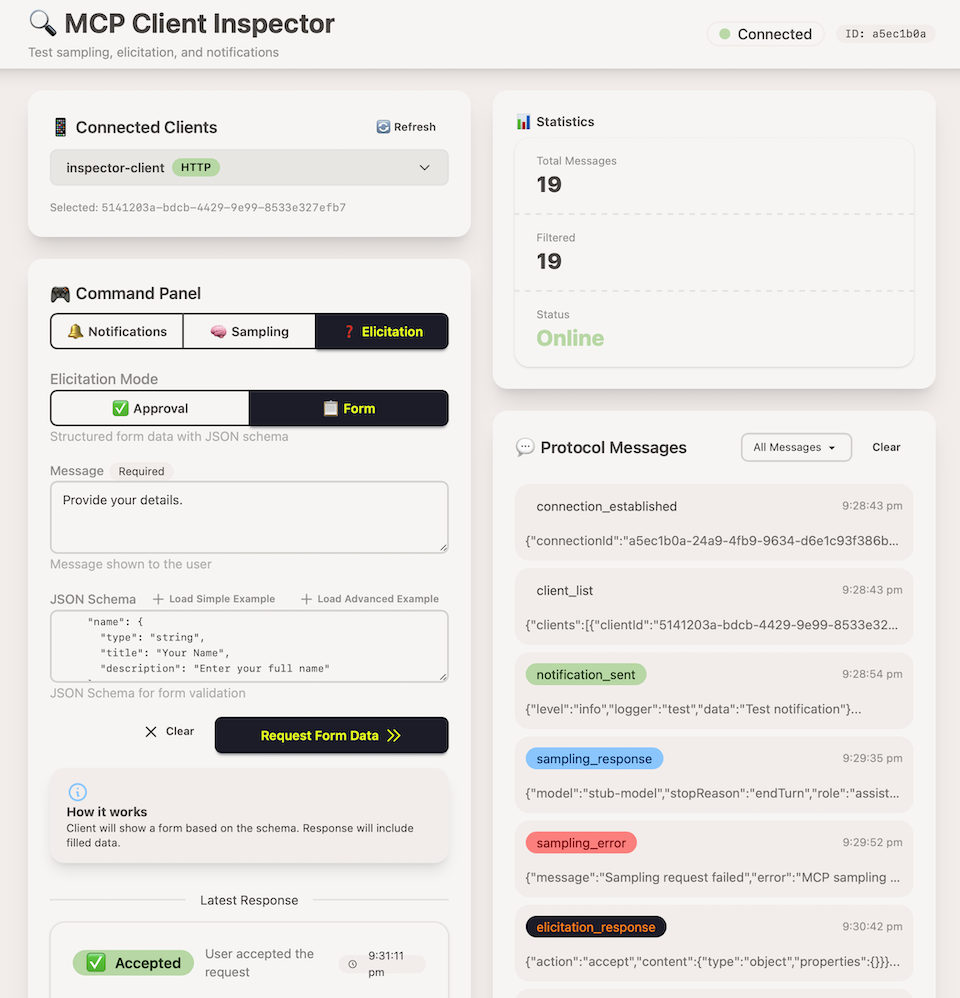

# Beyond MCP Client Inspector

[](https://beyondbetter.app)


[](https://github.com/Beyond-Better/bb-mcp-server)

[](https://jsr.io/@beyondbetter/bb-mcp-client-inspector)
[](https://jsr.io/@beyondbetter/bb-mcp-client-inspector)
[](https://jsr.io/@beyondbetter)
[](https://opensource.org/licenses/MIT)

**A comprehensive testing platform for MCP (Model Context Protocol) client
implementations**

## Overview

The MCP Server Client Inspector provides an interactive web console for testing
and validating MCP client implementations. While the
[MCP Inspector](https://github.com/modelcontextprotocol/inspector) exists as an
MCP client for testing servers, this project fills the inverse need - an MCP
server for testing clients.

### Key Features

- 🔍 **Protocol Message Inspection**: View all MCP JSON-RPC messages in
  real-time
- 🧠 **Sampling Testing**: Test client LLM completion capabilities
- ❓ **Elicitation Testing**: Test client user input request handling
- 🔔 **Notification Testing**: Trigger and verify list change notifications
- 🛠️ **Inspector Tools**: Six utility tools for testing scenarios
- 📊 **Multi-Client Support**: Test multiple clients simultaneously (HTTP mode)
- 🌐 **Web Console**: Interactive Fresh UI for testing



## Installation

### Prerequisites

- **Deno 2.5+** - [Install Deno](https://deno.land/)
- **Git** - For cloning the repository

### Quick Setup

1. **Clone the repository:**
   ```bash
   git clone https://github.com/Beyond-Better/bb-mcp-server-client-inspector.git
   cd bb-mcp-server-client-inspector
   ```

2. **Set up the MCP Server:**
   ```bash
   cd mcp-server
   cp .env.example .env
   # Edit .env if needed (defaults work for local development)
   ```

3. **Set up the Fresh UI:**
   ```bash
   cd ../fresh-ui
   cp .env.example .env
   # Edit .env if needed (defaults work for local development)
   ```

### Running the Servers

You'll need two terminal windows:

**Terminal 1 - MCP Server:**

```bash
cd mcp-server
deno task dev
```

The MCP server will start on `http://localhost:3000`

**Terminal 2 - Fresh UI:**

```bash
cd fresh-ui
deno task dev
```

The Fresh UI will start on `http://localhost:8000`

### Verification

1. Open your browser to `http://localhost:8000`
2. You should see the MCP Client Inspector interface
3. The console should show "WebSocket connected" when the connection is established
4. Try the inspector tools to verify everything is working

> **📖 Detailed Instructions:** For configuration options, troubleshooting, and advanced setup, see [INSTALLATION.md](./INSTALLATION.md)

## Architecture

### Dual-Server Design

```
┌─────────────────────────────────────┐
│  MCP Server (Deno)                  │
│  ├─ STDIO/HTTP transport (MCP)      │
│  ├─ WebSocket endpoint (/ws/console)│
│  ├─ Inspector tools                 │
│  └─ Session management (KV)         │
└──────────────┬──────────────────────┘
               │ WebSocket
               │ (real-time updates)
┌──────────────▼──────────────────────┐
│  Fresh UI Server (Deno Fresh)       │
│  ├─ Console UI routes               │
│  ├─ WebSocket client                │
│  ├─ Hot reload (dev mode)           │
│  └─ Static assets                   │
└─────────────────────────────────────┘
```

### Technology Stack

**MCP Server**:

- Runtime: Deno 2.5+
- Framework: bb-mcp-server library
- MCP SDK: @modelcontextprotocol/sdk v1.18.2
- Storage: Deno KV
- Language: TypeScript

**Fresh UI**:

- Framework: Deno Fresh
- UI: Preact Islands
- Styling: Tailwind CSS + DaisyUI
- Language: TypeScript + JSX

## Project Structure

```
bb-mcp-server-client-inspector/
├── docs/                           # Comprehensive design documentation
│   ├── 01-PROJECT_OVERVIEW.md      # Project summary and goals
│   ├── 02-ARCHITECTURE.md          # System architecture
│   ├── 03-MCP_SERVER_DESIGN.md     # MCP server specifications
│   ├── 04-FRESH_UI_DESIGN.md       # Fresh UI specifications
│   ├── 05-DATA_MODELS.md           # Type definitions
│   ├── 06-WEBSOCKET_PROTOCOL.md    # Console communication protocol
│   ├── 07-TESTING_STRATEGY.md      # Testing approach
│   └── 08-IMPLEMENTATION_PHASES.md # Development roadmap
├── mcp-server/                     # MCP Server
│   ├── main.ts
│   ├── src/
│   │   ├── plugins/
│   │   │   └── inspector.plugin/
│   │   ├── console/
│   │   └── dependencyHelper.ts
│   └── tests/
├── fresh-ui/                       # Fresh UI Server
│   ├── main.ts
│   ├── routes/
│   ├── islands/
│   ├── components/
│   └── hooks/
└── shared/                         # Shared types
    └── types/
```

## Documentation

### For Implementers (LLMs)

Read the design documents in this order:

1. **[PROJECT_OVERVIEW.md](docs/01-PROJECT_OVERVIEW.md)** - Start here for
   context and goals
2. **[ARCHITECTURE.md](docs/02-ARCHITECTURE.md)** - Understand the system
   architecture
3. **[MCP_SERVER_DESIGN.md](docs/03-MCP_SERVER_DESIGN.md)** - MCP server
   implementation details
4. **[FRESH_UI_DESIGN.md](docs/04-FRESH_UI_DESIGN.md)** - Fresh UI
   implementation details
5. **[DATA_MODELS.md](docs/05-DATA_MODELS.md)** - Type definitions and
   interfaces
6. **[WEBSOCKET_PROTOCOL.md](docs/06-WEBSOCKET_PROTOCOL.md)** - Console
   communication protocol
7. **[TESTING_STRATEGY.md](docs/07-TESTING_STRATEGY.md)** - Testing approach and
   examples
8. **[IMPLEMENTATION_PHASES.md](docs/08-IMPLEMENTATION_PHASES.md)** - Phased
   development plan

### Quick Start Guide

Each document is comprehensive and self-contained. For implementation:

- **Phase 1**: Focus on MCP_SERVER_DESIGN.md and basic infrastructure
- **Phase 2**: Reference WEBSOCKET_PROTOCOL.md and FRESH_UI_DESIGN.md
- **Phase 3**: Use DATA_MODELS.md for shared types
- **Phase 4**: Follow TESTING_STRATEGY.md for test implementation

## Inspector Tools

The server includes six utility tools for testing:

1. **echo** - Echo messages with optional delay and transformation
2. **convert_date** - Date/timezone conversion and formatting
3. **calculate** - Basic arithmetic operations
4. **delay_response** - Configurable delays (for timeout testing)
5. **random_data** - Generate random test data
6. **trigger_error** - Intentionally trigger errors (for error handling tests)

## Testing Capabilities

### Sampling

Test client LLM completion capabilities:

- Simple text prompts
- Model preferences
- Temperature and max tokens
- Response handling

### Elicitation

Test client user input requests:

- Simple text input
- Structured data (with JSON schema)
- Accept/decline/cancel responses
- Schema validation

### Notifications

Trigger and verify notifications:

- `notifications/tools/list_changed`
- `notifications/resources/list_changed`
- `notifications/prompts/list_changed`

## Development Roadmap

### Version 1.0 (Initial Release)

**Phase 1: Foundation** (Day 1)

- ✅ MCP server with bb-mcp-server
- ✅ Basic inspector tools
- ✅ Message storage (Deno KV)
- ✅ Fresh UI foundation

**Phase 2: Core Features** (Day 2)

- ✅ WebSocket communication
- ✅ Sampling request/response
- ✅ Elicitation request/response
- ✅ Notification triggering
- ✅ Message viewer

**Phase 3: Polish** (Day 3)

- ✅ Multi-client support
- ✅ UI refinement
- ✅ Error handling
- ✅ Performance optimization

**Phase 4: Release** (Day 4)

- ✅ Complete documentation
- ✅ Message filtering in UI
- ✅ Comprehensive testing
- ✅ Example scenarios
- ✅ Deployment preparation

### Roadmap (Future Versions)

- 🔄 Multi-turn sampling conversations
- 🔄 Full suite of MCP features (prompts/roots/resources)
- 🔄 Streaming response support
- 🔄 Pre-configured test scenarios
- 🔄 Session export/import
- 🔄 Client metrics and analytics
- 🔄 WebSocket authentication

## Design Principles

### Separation of Concerns

- **MCP Server**: Handles MCP protocol, tool execution, message tracking
- **Fresh UI**: Handles user interface, visualization, user interactions
- **WebSocket**: Real-time communication bridge between server and UI

### Simplicity First

- **v1.0 Features**: Essential testing capabilities only
- **Roadmap Items**: Advanced features for future versions
- **Clear Boundaries**: Each component has a single responsibility

### Production Quality

- **Comprehensive Testing**: >80% code coverage
- **Error Handling**: Graceful degradation and recovery
- **Documentation**: Complete specs for implementation
- **Type Safety**: Strict TypeScript throughout

## Implementation Guidelines

### Prerequisites

```bash
# Deno 2.5+
deno --version

# bb-mcp-server library
deno info jsr:@beyondbetter/bb-mcp-server
```

### Development Setup

```bash
# Terminal 1: MCP Server
cd mcp-server
cp .env.example .env
deno task dev

# Terminal 2: Fresh UI
cd fresh-ui
cp .env.example .env
deno task dev
```

### Testing

```bash
# MCP Server tests
cd mcp-server
deno task test

# UI tests
cd fresh-ui
deno task test
```

## Key Design Decisions

### 1. Separate Processes

**Why**: Clean separation of concerns, independent development, Fresh hot reload
works naturally

**Alternative Considered**: Embedded Fresh app in MCP server (too complex)

### 2. WebSocket Communication

**Why**: Real-time updates, low latency, bidirectional communication

**Alternative Considered**: HTTP polling (higher latency, more overhead)

### 3. bb-mcp-server Library

**Why**: Proven infrastructure, plugin system, built-in session management

**Alternative Considered**: Raw MCP SDK (more boilerplate, reinventing
infrastructure)

### 4. Deno KV Storage

**Why**: Built-in, fast, simple API, perfect for session data

**Alternative Considered**: External database (unnecessary complexity for v1.0)

### 5. Fresh Islands

**Why**: Minimal JavaScript, fast rendering, easy to understand

**Alternative Considered**: SPA framework (more complexity, larger bundle)

## Success Metrics

### Functionality

- ✅ Successfully tests sampling requests and responses
- ✅ Successfully tests elicitation flows (accept/decline/cancel)
- ✅ Successfully triggers and verifies notifications
- ✅ Displays all MCP protocol messages clearly
- ✅ Handles multiple connected clients (HTTP mode)

### Usability

- ✅ Simple setup (< 5 minutes from clone to running)
- ✅ Intuitive UI (minimal learning curve)
- ✅ Clear error messages and feedback
- ✅ Responsive real-time updates

### Quality

- ✅ Comprehensive test coverage (>80%)
- ✅ Clear documentation for LLM consumption
- ✅ Example test scenarios included
- ✅ Production-ready error handling

## Contributing

This project is designed for implementation by LLMs following the comprehensive
design documentation. When contributing:

1. Read the relevant design documents first
2. Follow the implementation phases
3. Write tests alongside implementation
4. Update documentation as needed
5. Ensure type safety throughout

## License

MIT License (recommended for maximum adoption)

## Project Status

**Current**: Design Complete - Ready for Implementation

- ✅ Comprehensive design documentation
- ✅ Architecture finalized
- ✅ Type definitions specified
- ✅ Testing strategy defined
- ✅ Implementation phases planned
- 🔨 Implementation: Not started

## Next Steps

For implementers:

1. Review PROJECT_OVERVIEW.md for context
2. Study ARCHITECTURE.md for system understanding
3. Begin Phase 1 implementation following IMPLEMENTATION_PHASES.md
4. Reference specific design documents as needed
5. Write tests following TESTING_STRATEGY.md

## Repository

**GitHub**: `beyond-better/bb-mcp-server-client-inspector`

**JSR Package**: `@beyondbetter/mcp-client-inspector` (planned)

---

**Project Version**: 0.1.0 (Design) **Documentation Version**: 1.0 **Last
Updated**: 2025-10-22 **Status**: Design Complete - Ready for Implementation

---

_Built with ❤️ for the MCP community_
