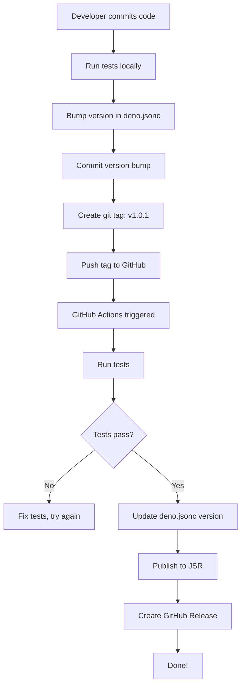

# JSR Publishing Setup - Complete Summary

This document summarizes the complete JSR publishing setup for the MCP Client
Inspector project.

## Overview

The project is now configured as a **single JSR package with multiple entry
points**, allowing users to:

1. **Run both components together** (default)
2. **Run MCP Server only**
3. **Run Fresh UI only**

All directly from JSR without cloning the repository.

## Files Created/Modified

### 1. Root Wrapper Script: `main.ts`

**Purpose**: Launches both MCP Server and Fresh UI components simultaneously.

**Key Features**:

- Spawns both servers as child processes
- Configurable ports and hosts via CLI arguments
- Proper cleanup on exit (Ctrl+C)
- Help command with usage examples
- Environment variable passthrough

**Usage Examples**:

```bash
# Default (MCP on :3000, UI on :8000)
deno run -A jsr:@beyondbetter/mcp-client-inspector

# Custom ports
deno run -A jsr:@beyondbetter/mcp-client-inspector --mcp-port 3001 --ui-port 8080

# Help
deno run -A jsr:@beyondbetter/mcp-client-inspector --help
```

### 2. Updated Root Configuration: `deno.jsonc`

**Changes**:

- Added `exports` field with three entry points:
  - `"."` → `./main.ts` (run both)
  - `"./mcp-server"` → `./mcp-server/main.ts` (MCP server only)
  - `"./fresh-ui"` → `./fresh-ui/main.ts` (Fresh UI only)
- Added `"start"` task for running both components
- Updated `"check"` task to include `main.ts`
- Added `@std/cli` import for argument parsing
- Enhanced `publish.exclude` to exclude docs, screenshots, and test files

### 3. GitHub Workflow: `.github/workflows/test.yaml`

**Purpose**: Automated testing on every push/PR

**Steps**:

1. Formatting check (`deno fmt --check`)
2. Linting (`deno lint`)
3. Type checking (`deno task check`)
4. Run tests (`deno task test`)
5. Generate coverage (`deno task test:coverage`)
6. Upload to Codecov (optional)

**Triggers**:

- Push to `main` or `develop` branches
- Pull requests to `main` or `develop` branches

### 4. GitHub Workflow: `.github/workflows/publish.yaml`

**Purpose**: Automated publishing to JSR

**Steps**:

1. Run all tests (same as test workflow)
2. Extract version from git tag or manual input
3. Update `deno.jsonc` with version
4. Publish to JSR with `deno publish --allow-dirty`

**Triggers**:

- Git tags matching `v*.*.*` (e.g., `v1.0.0`)
- Manual dispatch with version input

**Required Permissions**:

```yaml
permissions:
  contents: read
  id-token: write # For JSR OIDC authentication
```

### 5. Documentation: `INSTALLATION.md`

**Contents**:

- JSR installation instructions
- Running from source instructions
- Environment configuration
- Prerequisites
- Troubleshooting guide
- Next steps after installation

### 6. Documentation: `PUBLISHING.md`

**Contents**:

- Package structure explanation
- Automated publishing workflow details
- Creating releases (git tag method)
- Creating releases (manual dispatch method)
- Version management guidelines
- Publishing checklist
- Troubleshooting publishing issues
- Post-publishing tasks

## Architecture: Multi-Entry Point Strategy

### Why This Approach?

Instead of publishing three separate packages, we use **one package with
multiple exports**:

**Benefits**:

- ✅ Single version to manage
- ✅ Shared dependencies (no duplication)
- ✅ Simpler publishing workflow
- ✅ Easier to keep components in sync
- ✅ Users can choose what to run

**Trade-offs**:

- ⚠️ Users download all code even if using one component
- ⚠️ Package size is larger (but still reasonable)

### How It Works

```
@beyondbetter/mcp-client-inspector/
├── main.ts                  (default export - runs both)
├── mcp-server/
│   └── main.ts             (mcp-server export)
├── fresh-ui/
│   └── main.ts             (fresh-ui export)
└── shared/
    └── types/              (shared by both)
```

When published to JSR:

```bash
# Default export
jsr:@beyondbetter/mcp-client-inspector
# Resolves to: main.ts → spawns both servers

# Named export
jsr:@beyondbetter/mcp-client-inspector/mcp-server
# Resolves to: mcp-server/main.ts → runs MCP server

# Named export
jsr:@beyondbetter/mcp-client-inspector/fresh-ui
# Resolves to: fresh-ui/main.ts → runs Fresh UI
```

## Component Communication

The wrapper script (`main.ts`) passes environment variables to configure
component communication:

```typescript
// MCP Server environment
{
  MCP_SERVER_PORT: options.mcpPort.toString(),
  MCP_SERVER_HOST: options.mcpHost,
}

// Fresh UI environment
{
  PORT: options.uiPort.toString(),
  HOST: options.uiHost,
  MCP_SERVER_URL: `http://${options.mcpHost}:${options.mcpPort}`,
}
```

This ensures both components know how to communicate regardless of custom ports.

## Publishing Workflow

### Automated Release Process



### Quick Release Guide

```bash
# 1. Update version
vim deno.jsonc  # Change version to "1.0.1"

# 2. Commit
git commit -am "Bump version to 1.0.1"

# 3. Create and push tag
git tag v1.0.1
git push origin v1.0.1

# 4. Watch GitHub Actions
# Go to: https://github.com/Beyond-Better/bb-mcp-client-inspector/actions

# 5. Verify on JSR
# Visit: https://jsr.io/@beyondbetter/mcp-client-inspector
```

## Testing the Setup

### Local Testing (Before Publishing)

```bash
# 1. Test the wrapper script
deno run -A main.ts
# Should start both servers

# 2. Test with custom ports
deno run -A main.ts --mcp-port 3001 --ui-port 8080

# 3. Test individual components
deno task start:mcp
deno task start:ui

# 4. Run tests
deno task test

# 5. Check formatting and linting
deno fmt --check
deno lint

# 6. Type check
deno task check

# 7. Dry-run publish
deno publish --dry-run
```

### After Publishing

```bash
# Test JSR package (replace 1.0.0 with actual version)
deno run -A jsr:@beyondbetter/mcp-client-inspector@1.0.0

# Test individual exports
deno run -A jsr:@beyondbetter/mcp-client-inspector@1.0.0/mcp-server
deno run -A jsr:@beyondbetter/mcp-client-inspector@1.0.0/fresh-ui
```

## Known Considerations

### 1. Permissions

The wrapper requires all permissions because it spawns child processes:

```bash
-A  # All permissions (simplified)

# Or explicitly:
--allow-net      # Network access for servers
--allow-read     # Read access for configuration
--allow-write    # Write access for logs/data
--allow-env      # Environment variable access
--allow-run      # Spawn child processes
```

### 2. Process Management

The wrapper handles graceful shutdown:

- Listens for Ctrl+C
- Sends SIGTERM to both child processes
- Waits for clean exit
- Handles if either process exits early

### 3. Version Consistency

Three `deno.jsonc` files exist:

- `/deno.jsonc` (root - **source of truth for JSR**)
- `/mcp-server/deno.jsonc` (component config)
- `/fresh-ui/deno.jsonc` (component config)

**Best Practice**: Keep versions in sync manually, but only root version matters
for publishing.

### 4. Import Map Complexity

The project has:

- `import_map.json` (production imports)
- `import_map.dev.json` (development imports)

When published to JSR, only `import_map.json` is used. Ensure all dependencies
are correctly specified there.

## Troubleshooting

### "Cannot find module" when running from JSR

**Cause**: Import map not correctly configured in root `deno.jsonc`.

**Solution**: Ensure all imports use correct specifiers (`jsr:`, `npm:`).

### Wrapper doesn't start components

**Cause**: Path resolution issues in `main.ts`.

**Solution**: Check that `new URL("./mcp-server/main.ts", import.meta.url)`
resolves correctly.

### GitHub Actions fails to publish

**Cause**: Missing `id-token: write` permission.

**Solution**: Check `.github/workflows/publish.yaml` has correct permissions
block.

### Version conflict on publish

**Cause**: Version already exists on JSR.

**Solution**: Bump version and republish. Cannot overwrite existing versions.

## Next Steps

1. **Test locally**: Run `deno run -A main.ts` to verify wrapper works
2. **Test components**: Run each component individually
3. **Run test suite**: `deno task test` to ensure everything passes
4. **Dry-run publish**: `deno publish --dry-run` to verify package contents
5. **Create test tag**: Create `v1.0.0-beta.1` to test publish workflow
6. **Monitor workflow**: Watch GitHub Actions for any issues
7. **Test published package**: Run from JSR to verify it works
8. **Create v1.0.0**: Create production release when ready

## References

- **INSTALLATION.md**: User-facing installation guide
- **PUBLISHING.md**: Developer/maintainer publishing guide
- **deno.jsonc**: Package configuration and exports
- **main.ts**: Wrapper script implementation
- **.github/workflows/**: CI/CD automation

---

**Setup Date**: 2025-10-25\
**Status**: ✅ Complete and ready for testing\
**Next Milestone**: First beta release to JSR
